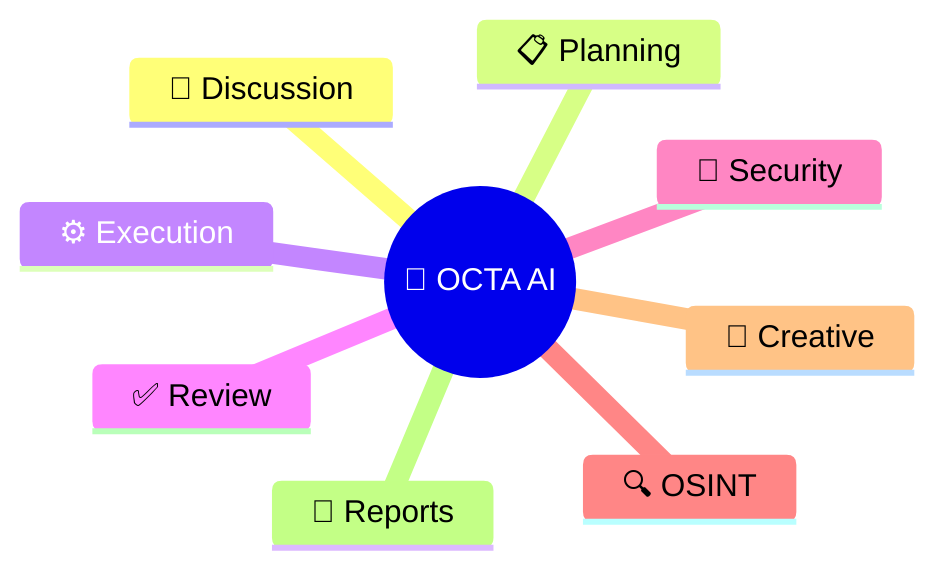
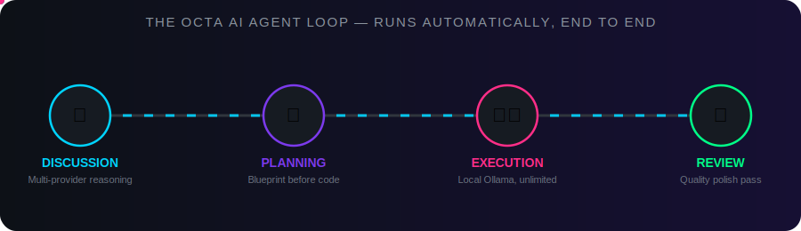
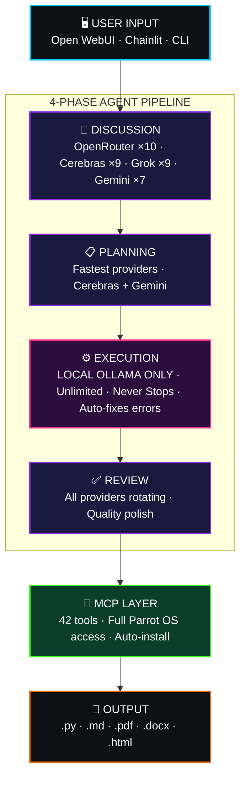
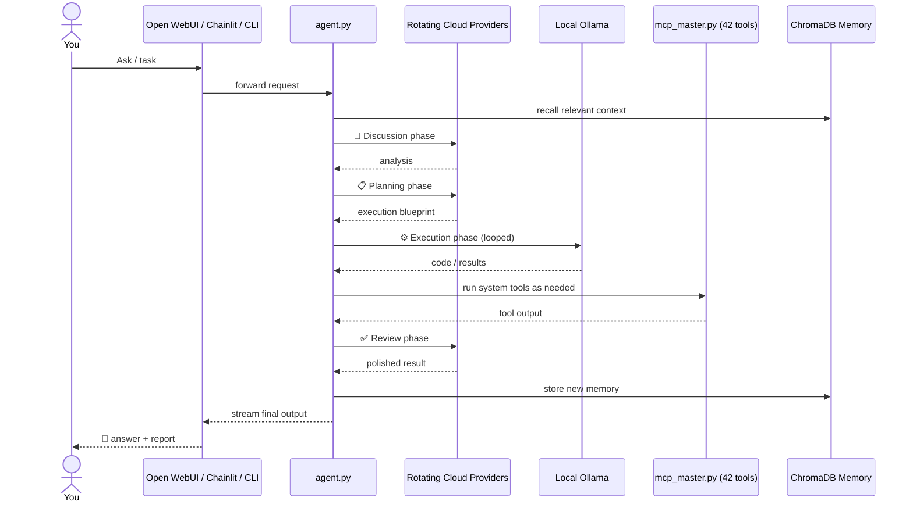
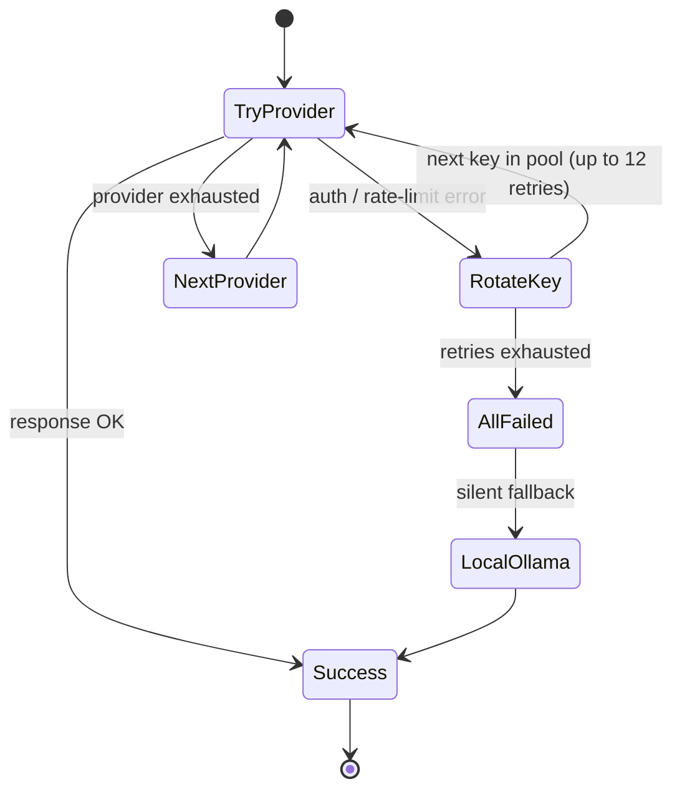
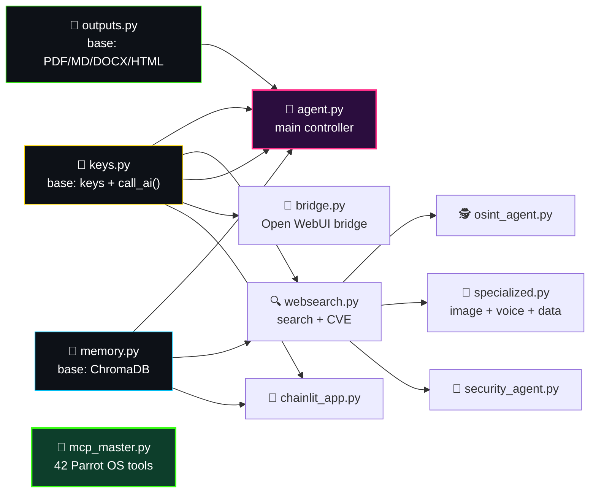
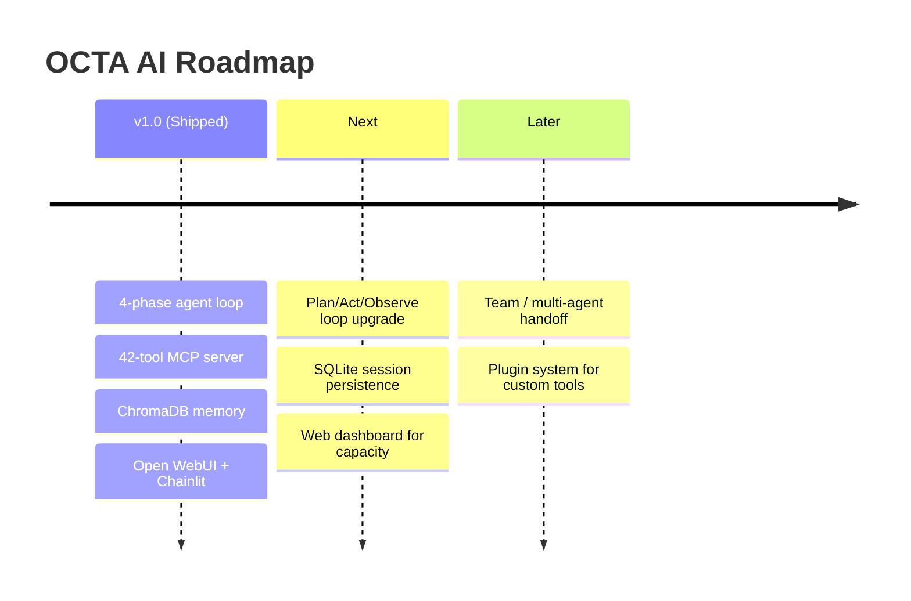

<div align="center">




<br/><br/>


<br/>


<br/><br/>

[](https://github.com/lawcy0fficial/octa-ai/stargazers)
[](https://github.com/lawcy0fficial/octa-ai/network/members)
[](https://github.com/lawcy0fficial/octa-ai/issues)
[](https://github.com/lawcy0fficial/octa-ai/commits)
[](LICENSE)

[]()
[]()
[]()
[]()
[]()
[]()
[]()


</div>

<br/>

> [!TIP]
> **Jump straight in:** [🚀 Quick Start](#-quick-start-60-seconds) to run it now, [🏗️ Architecture](#️-architecture-the-4-phase-agent-loop) to see how the brain is wired, or [🧰 All 42 MCP Tools](#-all-42-mcp-tools) for the full tool inventory.

<div align="center">

## 📚 Table of Contents

<table width="100%">
<tr>
<td width="25%" align="center">🐙<br/><a href="#-what-is-octa-ai">What is it</a></td>
<td width="25%" align="center">🦾<br/><a href="#-the-8-powers-of-octa-ai">8 Powers</a></td>
<td width="25%" align="center">🏗️<br/><a href="#️-architecture-the-4-phase-agent-loop">Architecture</a></td>
<td width="25%" align="center">✨<br/><a href="#-key-features">Features</a></td>
</tr>
<tr>
<td align="center">📦<br/><a href="#-module-map">Module Map</a></td>
<td align="center">🧰<br/><a href="#-all-42-mcp-tools">42 MCP Tools</a></td>
<td align="center">🚀<br/><a href="#-quick-start-60-seconds">Quick Start</a></td>
<td align="center">💬<br/><a href="#-agent-commands">Commands</a></td>
</tr>
<tr>
<td align="center">📊<br/><a href="#-free-api-capacity">API Capacity</a></td>
<td align="center">🧭<br/><a href="#-how-the-router-works">Router Logic</a></td>
<td align="center">🖥️<br/><a href="#️-example-session">Example Session</a></td>
<td align="center">⚖️<br/><a href="#️-octa-ai-vs-the-alternatives">Comparison</a></td>
</tr>
<tr>
<td align="center">🔐<br/><a href="#-security-research-modules">Security</a></td>
<td align="center">🗺️<br/><a href="#️-roadmap">Roadmap</a></td>
<td align="center">🛠️<br/><a href="#️-tech-stack">Tech Stack</a></td>
<td align="center">📁<br/><a href="#-project-structure">Structure</a></td>
</tr>
<tr>
<td align="center">🧯<br/><a href="#-troubleshooting">Troubleshooting</a></td>
<td align="center">📖<br/><a href="#-glossary">Glossary</a></td>
<td align="center">❓<br/><a href="#-faq">FAQ</a></td>
<td align="center">🌟<br/><a href="#-support-the-project">Support</a></td>
</tr>
</table>

</div>


## 🐙 What is OCTA AI?

<table>
<tr>
<td width="58%" valign="top">

**OCTA AI** is a self-hosted, **Claude.ai-inspired agentic AI system** built for professional security researchers — architected and built **solo**, from a **non-CS background**, on top of **free-tier APIs only**.

Like an octopus with eight arms, OCTA AI reasons, plans, codes, reviews, hacks, investigates, creates, and reports — all from one brain. It routes across **7 rotating cloud providers + unlimited local inference**, for **$0/month, forever**.

It isn't a wrapper around a single API key. It's a full **multi-provider routing brain** with automatic failover, a **never-stopping agentic coding loop**, **persistent vector memory**, a **42-tool MCP server** for full OS access, and dedicated modules for security research, OSINT, and digital forensics.

<div align="center">


</div>

</td>
<td width="42%" valign="top">



</td>
</tr>
</table>

> [!NOTE]
> **Zero-cost by design.** Every cloud provider wired into OCTA AI (OpenRouter, Cerebras, Grok/xAI, Gemini, Requesty, Novita, HuggingFace) is used strictly on its free tier, rotated across multiple keys per provider. When cloud quota runs dry, it falls back to **local Ollama** — unlimited, private, offline.

<div align="center">

### 📊 By The Numbers


</div>

---

## 🦾 The 8 Powers of OCTA AI

<div align="center">

</div>

<br/>

<div align="center">

| Arm | Power | What it does |
|:---:|:---|:---|
| 🧠 | **Discussion & Deep Analysis** | Multi-provider reasoning for open-ended technical questions |
| 📋 | **Strategic Planning** | Breaks any task into an executable blueprint before writing code |
| ⚙️ | **Agentic Code Execution** | A never-stopping loop that writes, runs, and self-corrects code until it works |
| ✅ | **Quality Review & Polish** | Independent pass to catch bugs, sloppy logic, and missed edge cases |
| 🔐 | **Security Research & Pentesting** | Nmap, Nuclei, SearchSploit, CVE lookups, YARA/AV scanning |
| 🔍 | **OSINT & Intelligence** | Domain, IP, username, and GitHub reconnaissance, automated |
| 🎨 | **Image & Voice Generation** | Free image gen (Pollinations.ai) + local TTS (Coqui) |
| 📄 | **Professional Reporting** | Auto-exports findings as PDF, DOCX, Markdown, or HTML |

</div>


## 🏗️ Architecture: The 4-Phase Agent Loop



<details>
<summary><b>🔬 Click to expand: request lifecycle, step by step</b></summary>



</details>

<details>
<summary><b>🔬 Click to expand: why execution is <i>local-only</i></b></summary>
<br/>

Every phase except execution rotates across free cloud APIs to spread load and dodge rate limits. **Execution deliberately never touches the cloud** — it runs entirely on local Ollama models (`qwen2.5-coder`, `phi3:mini`) so that:
- Agentic code loops are **unlimited** (no per-request billing risk)
- Generated code and findings **never leave the machine**
- There are **no upstream content filters** interrupting a legitimate, authorized security-research task mid-loop

</details>

---

## 🧭 How The Router Works

`keys.py` is the shared brain every module imports `call_ai()` from. It doesn't just pick "an AI" — it picks the **right pool of models for the phase**, then rotates through providers and keys until one answers.

<div align="center">

| Pool | Used by | Primary models | Purpose |
|:--|:--|:--|:--|
| `DISCUSSION_POOL` | Discussion phase | Live OpenRouter free models → Gemini 2.5 Flash → Grok → Cerebras Llama 3.3 70B | Best reasoning quality |
| `PLANNING_POOL` | Planning phase | Cerebras Llama 3.3 70B → Gemini 2.5 Flash → Grok → OpenRouter | Fastest response time |
| `EXECUTION_POOL` | Execution phase | `ollama/phi3:mini` → `ollama/qwen2.5:3b` → `ollama/llama3.2:3b` | Local-only, unlimited |
| `REVIEW_POOL` | Review phase | Live OpenRouter free models → Gemini → Cerebras → Grok | Best quality polish |
| `VISION_POOL` | Image analysis | Gemini 2.5 Flash | Only pool provider with vision support |
| `ONLINE_POOL` | General fallback | Live OpenRouter free models + Cerebras + Gemini + Grok | Catch-all cloud pool |

</div>

The OpenRouter slice of every cloud pool is **fetched live** on startup rather than hardcoded — free `:free` model slugs on OpenRouter get added and retired without notice, so `keys.py` pulls the current list and falls back to an offline cached list only if that fetch fails.



> [!TIP]
> `call_ai()` defaults to **12 retries** across rotating keys before giving up on the cloud entirely — in practice this means a single exhausted key almost never surfaces as an error to you; the router just quietly moves to the next one.

---

## ✨ Key Features

<table width="100%">
<tr>
<td width="33%" valign="top">

### 🤖 AI Core
- Multi-provider rotation — **82,500+ free req/day**
- Agentic coding loop — never stops until done
- Auto-fixes syntax errors on the fly
- Persistent memory via **ChromaDB**
- Word-by-word streaming (Claude.ai-style)
- Vision — screenshots, evidence, diagrams
- Real-time web search + CVE lookups

</td>
<td width="33%" valign="top">

### 🔐 Security Research
- Vuln scanning — Nmap + Nuclei + AI CVSS
- CVE research — NVD + ExploitDB PoCs
- Digital forensics — file/hex/strings/YARA/AV
- Malware static analysis + AI classification
- Bug bounty recon — subdomain + dir + tech
- OSINT — domain / IP / username / GitHub
- SSL/TLS + WHOIS + DNS deep inspection

</td>
<td width="33%" valign="top">

### 🎨 Creative & Ops
- Image generation — Pollinations.ai (free, no key)
- Voice synthesis — Coqui TTS (local, unlimited)
- CSV / log analysis with AI insights
- Multi-format reports — PDF, MD, DOCX, HTML
- Open WebUI + Chainlit + CLI + API bridge
- OpenAI-compatible FastAPI bridge

</td>
</tr>
</table>


## 📦 Module Map



---

## 🧰 All 42 MCP Tools

<div align="center"><i>Full inventory of <code>mcp_master.py</code> — every tool the agent can call directly on the OS.</i></div>
<br/>

<details>
<summary><b>🖥️ System & Shell (5 tools)</b></summary>

| Tool | Purpose |
|:--|:--|
| `run` | Execute a shell command |
| `run_root` | Execute a shell command as root |
| `install` | Install a tool if missing |
| `check` | Check whether a tool is installed |
| `ensure` | Install-if-missing + verify in one call |

</details>

<details>
<summary><b>📁 Filesystem (7 tools)</b></summary>

| Tool | Purpose |
|:--|:--|
| `read` | Read a file |
| `write` | Write/overwrite a file |
| `append` | Append to a file |
| `ls` | List a directory |
| `find` | Find files by pattern |
| `mkdir` | Create a directory |
| `hash_file` | Hash a file (integrity/forensics) |

</details>

<details>
<summary><b>🌐 Network & System Info (6 tools)</b></summary>

| Tool | Purpose |
|:--|:--|
| `net_info` | Local network interface info |
| `public_ip` | Get public-facing IP |
| `ping` | ICMP ping a host |
| `sys_info` | OS/host system info |
| `processes` | List running processes |
| `kill_process` | Kill a process by PID |

</details>

<details>
<summary><b>📦 Package Management (3 tools)</b></summary>

| Tool | Purpose |
|:--|:--|
| `apt_install` | Install via APT |
| `pip_install` | Install via pip |
| `go_install` | Install a Go-based tool |

</details>

<details>
<summary><b>🔐 Recon & Vulnerability Scanning (10 tools)</b></summary>

| Tool | Purpose |
|:--|:--|
| `nmap_scan` | Port/service scan |
| `whois_lookup` | WHOIS registration lookup |
| `dns_lookup` | DNS record lookup |
| `subdomain_enum` | Subdomain enumeration |
| `web_tech` | Web technology fingerprinting |
| `dir_enum` | Directory/endpoint brute force |
| `nuclei_scan` | Template-based vuln scanning |
| `ssl_scan` | SSL/TLS configuration audit |
| `searchsploit` | Local exploit-DB search |
| `get_cve` | CVE lookup by ID |

</details>

<details>
<summary><b>🧬 Digital Forensics & Malware (5 tools)</b></summary>

| Tool | Purpose |
|:--|:--|
| `file_type` | Identify file type/magic bytes |
| `strings_extract` | Extract printable strings |
| `hex_dump` | Hex-dump a file |
| `yara_scan` | YARA rule matching |
| `av_scan` | Antivirus scan a file |

</details>

<details>
<summary><b>📄 Reporting & Utility (6 tools)</b></summary>

| Tool | Purpose |
|:--|:--|
| `save_report` | Save findings as a report |
| `list_reports` | List saved reports |
| `download` | Download a file from a URL |
| `extract` | Extract an archive |
| `encode_base64` | Base64 encode |
| `decode_base64` | Base64 decode |

</details>


## 🚀 Quick Start (60 seconds)

<table>
<tr><td width="10%" align="center">1️⃣</td><td>

**Clone it**
```bash
git clone https://github.com/lawcy0fficial/octa-ai
cd octa-ai
```
</td></tr>
<tr><td align="center">2️⃣</td><td>

**Add your free API keys** to `keys.json` (grab them from the table in [🔑 API Keys Setup](#-api-keys-setup) — one provider is enough to start, Ollama works with zero cloud keys)
</td></tr>
<tr><td align="center">3️⃣</td><td>

**One-click setup**
```bash
chmod +x setup.sh && ./setup.sh
```
</td></tr>
<tr><td align="center">4️⃣</td><td>

**Verify everything**
```bash
bash test.sh
```
</td></tr>
<tr><td align="center">5️⃣</td><td>

**Launch** 🚀
```bash
bash start_all.sh
```
</td></tr>
</table>

<div align="center">

| Interface | Address |
|:--|:--|
| 🖼️ **Open WebUI** | `http://localhost:3000` |
| 💬 **Chainlit** | `chainlit run chainlit_app.py` |
| ⌨️ **CLI Agent** | `python3 agent.py` |
| 🔐 **Security Agent** | `python3 security_agent.py` |
| 🕵️ **OSINT Agent** | `python3 osint_agent.py` |

</div>

> [!IMPORTANT]
> Built and tested for **Parrot OS / Kali Linux** with **8GB RAM minimum**. `setup.sh` is idempotent — safe to re-run if a step fails partway through.


## 🖥️ Example Session

<div align="center"><i>What a real run through the 4-phase loop looks like from the CLI.</i></div>
<br/>

```console
$ python3 agent.py
🐙 OCTA AI v1.0 — 4-Phase Agentic System
Providers online: OpenRouter ×10 · Cerebras ×9 · Grok ×9 · Gemini ×7 · Requesty ×10 · Novita ×8 · Ollama ♾️

> Scan example-test-target.local for open ports and summarize risk

🧠 DISCUSSION   [openrouter/<live-free-model>]  → interpreting request, checking scope confirmation
📋 PLANNING     [cerebras/llama3.3-70b]         → blueprint: nmap_scan → nuclei_scan → get_cve → save_report
⚙️  EXECUTION    [ollama/qwen2.5:3b]             → running nmap_scan(target="example-test-target.local")
   → 3 open ports found: 22/tcp, 80/tcp, 443/tcp
⚙️  EXECUTION    [ollama/qwen2.5:3b]             → running nuclei_scan(severity="critical,high")
   → 1 medium finding: outdated TLS cipher suite on 443/tcp
✅ REVIEW       [gemini/gemini-2.5-flash]        → polishing findings, assigning CVSS context
📄 REPORT       → saved to reports/example-test-target-2026-07-18.pdf

Done in 4 phases · 6 tool calls · $0.00 spent
```

> [!NOTE]
> Output above is illustrative formatting only — actual model names, ports, and findings will reflect your real target and current live provider list.


## 💬 Agent Commands

<div align="center">

| Command | Description |
|:--|:--|
| `[any text]` | Run the full 4-phase OCTA AI agent |
| `stream [text]` | Word-by-word streaming response |
| `image [prompt]` | Generate image (Pollinations.ai) |
| `vision [path] [q]` | Analyze an image with AI |
| `search [query]` | Web search + AI analysis |
| `cve [service] [ver]` | CVE research (NVD + ExploitDB) |
| `osint [domain]` | Full OSINT automation |
| `tts [text]` | Text-to-speech (local, offline) |
| `setup-cc` | Configure Claude Code routing |
| `capacity` | Show live API capacity |

</div>

---

## 📊 Free API Capacity

<div align="center">

| Provider | Keys | Daily Limit | Speed |
|:--|:--:|:--|:--|
|  | ×10 | 56,000 req/day | Varies |
|  | ×9 | ~9M tokens/day | ⚡ 2,000 tok/s |
|  | ×9 | Large capacity | Fast |
|  | ×7 | 10,500 req/day | Fast (1M ctx) |
|  | ×10 | 16,000 req/day | Fast |
|  | ×8 | Free tier | Fast |
|  | ×1 | 2,000 req/day | Moderate |
|  | ♾️ | **UNLIMITED** | Local |

**🔥 Total: ~82,500+ requests/day, $0/month**


</div>

## 🔑 API Keys Setup

| Platform | Get a key | Keys used |
|:--|:--|:--:|
| OpenRouter | [openrouter.ai/keys](https://openrouter.ai/keys) | 10 |
| Cerebras | [cloud.cerebras.ai](https://cloud.cerebras.ai) | 9 |
| Grok/xAI | [x.ai/api](https://x.ai/api) | 9 |
| Gemini | [aistudio.google.com](https://aistudio.google.com/apikey) | 7 |
| Requesty | [requesty.ai](https://requesty.ai) | 10 |
| Novita | [novita.ai](https://novita.ai) | 8 |
| HuggingFace | [huggingface.co](https://huggingface.co/settings/tokens) | 1 |

> [!CAUTION]
> `keys.json` is already in `.gitignore` — **never remove that line**. It holds real, personal API keys. If you ever committed a real key by accident, revoke and rotate it at the provider immediately; deleting the file from a later commit does **not** remove it from git history.


## ⚖️ OCTA AI vs. The Alternatives

<div align="center">

| | 🐙 OCTA AI | Claude.ai Pro | ChatGPT Plus | Generic pentest wrapper |
|:--|:---:|:---:|:---:|:---:|
| Monthly cost | **$0** | ~$20 | ~$20 | Varies |
| Runs 100% local execution | ✅ | ❌ | ❌ | ⚠️ Sometimes |
| Full OS / shell access (MCP) | ✅ 42 tools | ❌ | ❌ | ⚠️ Limited |
| Dedicated security modules | ✅ | ❌ | ❌ | ✅ |
| Multi-provider failover | ✅ 7 providers | ❌ | ❌ | ❌ |
| Persistent vector memory | ✅ ChromaDB | ⚠️ Limited | ⚠️ Limited | ❌ |
| Self-hosted / private | ✅ | ❌ | ❌ | ⚠️ Depends |
| Unlimited agentic loop | ✅ Local Ollama | ⚠️ Rate-limited | ⚠️ Rate-limited | ⚠️ Depends |

</div>

<div align="center"><sub>Comparison reflects OCTA AI's default self-hosted configuration; official products' features may change over time.</sub></div>

---

## 🔐 Security Research Modules

> [!WARNING]
> **Authorized research only.** Every tool below must only be pointed at systems you own or have explicit **written** authorization to test. Bug bounty targets must be within program scope. `security_agent.py` asks you to confirm authorization before running scans — that's not decoration, it's the line between security research and a crime in most jurisdictions.

<div align="center">

| Module | Capabilities |
|:--|:--|
| 🩻 Vulnerability Scanner | Nmap + Nuclei + AI-assisted CVSS scoring |
| 📚 CVE Research | NVD + ExploitDB + SearchSploit lookup |
| 🧬 Digital Forensics | File-type / hex-dump / strings / hash analysis |
| 🦠 Malware Analysis | YARA rule matching + AV scan + AI classification |
| 🎯 Bug Bounty Recon | Subdomain enum + dir enum + tech fingerprinting |
| 🕵️ OSINT Engine | Domain / IP / Username / GitHub intel |
| 🔒 SSL/TLS & DNS Audit | Cert config review + WHOIS + DNS record inspection |

</div>

---

## 🗺️ Roadmap



---

## 🛠️ Tech Stack

<div align="center">


</div>

```
AI Framework:   LiteLLM (100+ providers, unified interface)
Memory:         ChromaDB (vector database)
GUI:            Open WebUI + Chainlit
API Bridge:     FastAPI + Uvicorn (OpenAI-compatible)
Local AI:       Ollama (qwen2.5-coder, phi3:mini)
MCP:            Model Context Protocol (42 tools)
Reports:        fpdf2 + python-docx
Search:         DuckDuckGo + NVD API
Image Gen:      Pollinations.ai (free)
Voice:          Coqui TTS (local)
Platform:       Parrot OS / Kali Linux
```


## 📁 Project Structure

```
octa-ai/
├── 🔑 keys.py              # Shared keys + AI calls (BASE)
├── 🧠 memory.py            # ChromaDB persistence (BASE)
├── 📄 outputs.py           # Report generation (BASE)
├── 🤖 agent.py             # Main OCTA AI agent
├── 🌉 bridge.py            # Open WebUI bridge
├── 💬 chainlit_app.py      # Chat interface
├── 🔌 mcp_master.py        # Parrot OS MCP (42 tools)
├── 🔍 websearch.py         # Web search + CVE
├── 🕵️  osint_agent.py       # OSINT automation
├── 🎨 specialized.py       # Image + Voice + Data
├── 🔐 security_agent.py    # Security research
├── 💻 claude_code_setup.py # Claude Code config
├── ⚙️  setup.sh             # One-click setup
├── 🚀 start_all.sh         # Start everything
├── ⏹️  stop_all.sh          # Stop everything
├── 🧪 test.sh              # Verify installation
├── 🔑 keys.json            # API keys — gitignored, fill in your own
├── 📦 requirements.txt     # Dependencies
├── 🖼️  logo.svg             # Static project logo
├── 📖 README.md            # This file (must stay in repo root)
└── 📂 docs/
    ├── 🎬 octa-banner-animated.svg   # Animated hero banner (used by README)
    ├── 🎬 octa-pipeline-animated.svg # Animated agent-loop diagram (used by README)
    └── 🎬 octa-spinner.svg           # Small animated loading spinner (used by README)
```

---

## 🧯 Troubleshooting

<details>
<summary><b>❌ <code>setup.sh</code> fails partway through</b></summary>
<br/>
It's idempotent — just re-run <code>./setup.sh</code>. It will skip anything already installed and resume from where it stopped.
</details>

<details>
<summary><b>❌ All cloud providers show 0 remaining requests</b></summary>
<br/>
Check <code>capacity</code> in the agent CLI. If cloud quota is exhausted, OCTA AI should automatically fall back to local Ollama — verify Ollama is running with <code>ollama list</code>.
</details>

<details>
<summary><b>❌ A security tool (Nmap/Nuclei/etc.) is "not found"</b></summary>
<br/>
Run the MCP <code>ensure</code> or <code>check</code> tool for that binary, or manually <code>apt_install</code> it — <code>setup.sh</code> installs the core set but package repos can vary by distro version.
</details>

<details>
<summary><b>❌ Open WebUI can't reach the bridge</b></summary>
<br/>
Confirm <code>bridge.py</code> is running and listening on the expected port, and that no firewall rule on the VM is blocking localhost traffic between containers/services.
</details>

---

## 🤝 Contributing

<div align="center">


</div>

Issues and PRs are welcome — especially new MCP tools, additional free-tier providers, and bug fixes. Please avoid submitting fully-automated web-injection scanning modules; keep contributions focused on authorized, defensible research tooling.

## 📖 Glossary

<details>
<summary><b>Click to expand acronym reference</b></summary>
<br/>

| Term | Meaning |
|:--|:--|
| **MCP** | Model Context Protocol — the standard OCTA AI uses to expose 42 OS-level tools to the agent |
| **OSINT** | Open-Source Intelligence — gathering info from publicly available sources |
| **CVE** | Common Vulnerabilities and Exposures — standardized vulnerability identifiers |
| **CVSS** | Common Vulnerability Scoring System — severity scoring (0–10) for a CVE |
| **YARA** | Pattern-matching rule engine used for malware/file classification |
| **TTS** | Text-to-Speech — voice synthesis, handled locally via Coqui |
| **SSE** | Server-Sent Events — the streaming protocol behind word-by-word responses |
| **WHOIS** | Domain registration lookup protocol |
| **PoC** | Proof of Concept — a minimal exploit demonstrating a vulnerability |
| **Ollama** | Local LLM runtime OCTA AI uses for unlimited, offline execution |
| **ChromaDB** | The vector database powering OCTA AI's persistent memory |

</details>


## ❓ FAQ

<details>
<summary><b>Does this actually cost $0/month?</b></summary>
<br/>
Yes — every cloud provider is used strictly within its free tier across multiple rotating keys, and the execution phase runs entirely on local Ollama. There's no paid API in the default configuration.
</details>

<details>
<summary><b>Do I need all 7 providers to get started?</b></summary>
<br/>
No. You need exactly one working provider key — or none at all if you're fine running purely on local Ollama.
</details>

<details>
<summary><b>Can I run this outside Parrot OS / Kali?</b></summary>
<br/>
Other Debian/Ubuntu systems will partially work, since <code>setup.sh</code> uses <code>apt</code> and assumes their tool repositories, but some pentest tools may be missing.
</details>

<details>
<summary><b>Is the security tooling safe to point at any target?</b></summary>
<br/>
No — only at systems you own or have explicit written authorization to test. See the <a href="#-security-research-modules">Security Research Modules</a> warning above.
</details>

<details>
<summary><b>Why does execution use tiny local models like <code>phi3:mini</code>?</b></summary>
<br/>
Speed and RAM footprint. The execution loop can run dozens of iterations per task, so small, fast local models keep that loop unlimited and responsive on modest hardware (8GB RAM). Discussion/Planning/Review lean on larger cloud models for reasoning quality where it matters most.
</details>

<details>
<summary><b>What happens if every cloud provider is rate-limited at once?</b></summary>
<br/>
<code>call_ai()</code> exhausts up to 12 retries rotating through every key in the pool, then the agent transparently continues on local Ollama rather than erroring out — see <a href="#-how-the-router-works">How The Router Works</a>.
</details>


## ⚖️ Legal Disclaimer

OCTA AI is designed for **authorized security research only**.

- All penetration testing requires written authorization
- Bug bounty hunting must stay within program scope
- Digital forensics requires legal authorization
- Malware analysis in isolated environments only
- Never test systems without explicit permission

---

## 🌟 Support the Project

<div align="center">

If OCTA AI saved you money, time, or taught you something about agentic architecture — a star helps other researchers find it.


**Ways to help:** star the repo · open issues for bugs · contribute a new MCP tool · share it with another researcher · read [`CONTRIBUTING.md`](CONTRIBUTING.md) and [`USAGE.md`](USAGE.md) for the deeper docs.

</div>

## 👨‍💻 Author

<div align="center">

**Independent Security Researcher** · Freelance since 2019 · Kerala, India

[](https://github.com/lawcy0fficial)
[](https://shibinoffi.github.io)

</div>

## 📄 License

MIT License — free for authorized security research and personal use. See [LICENSE](LICENSE).

---

<div align="center">

### ⭐ Star History


<br/><br/>


<br/><br/>


<br/>

<a href="#-table-of-contents">⬆️ Back to top</a>


</div>
