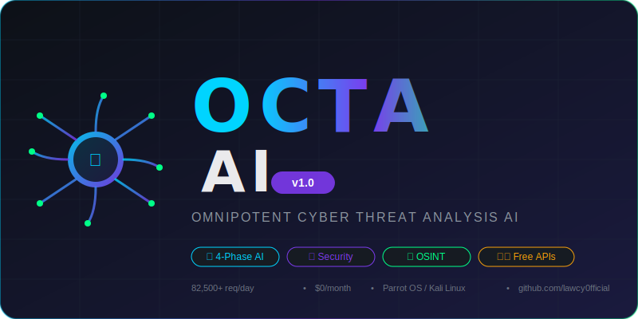
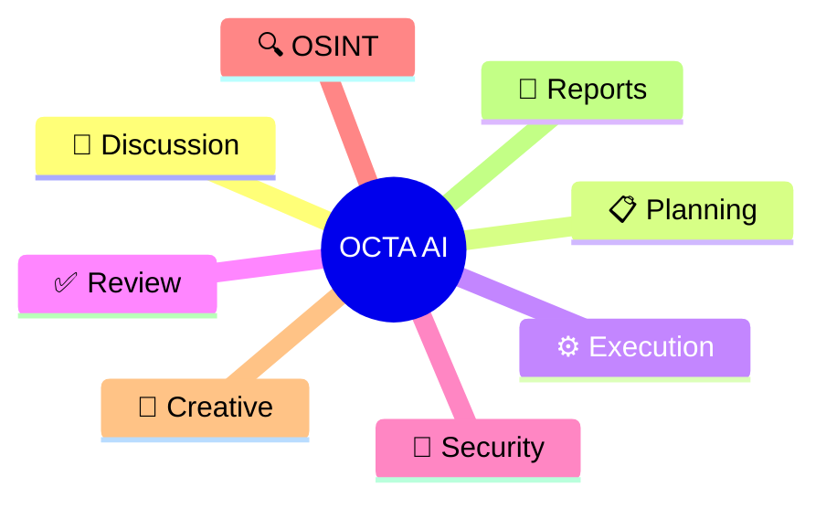
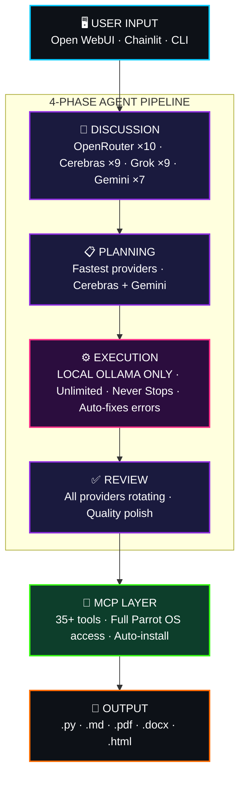
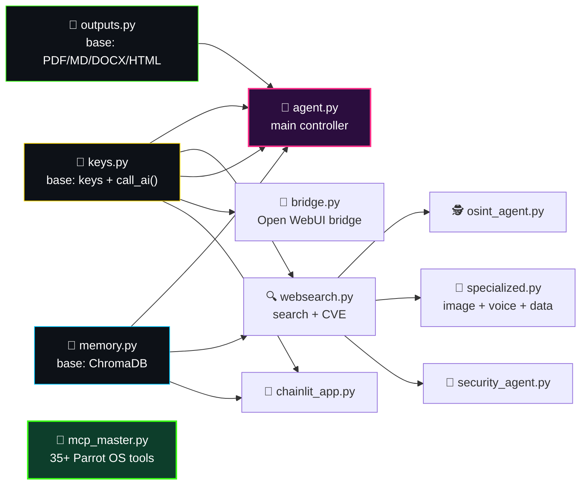

<div align="center">


<br/>

[](https://github.com/lawcy0fficial/octa-ai/stargazers)
[](https://github.com/lawcy0fficial/octa-ai/network/members)
[](LICENSE)
[]()
[]()

[]()
[]()
[]()
[]()


</div>

<br/>

<div align="center">
  
</div>

<br/>

> [!TIP]
> **Skip to what you need:** jump straight to [🚀 Quick Start](#-quick-start-60-seconds) if you just want it running, or [🏗️ Architecture](#️-architecture) if you want to see how the brain is wired.

## 📚 Table of Contents

<div align="center">

| | | | |
|:---:|:---:|:---:|:---:|
| [🐙 What is it](#-what-is-octa-ai) | [🦾 8 Powers](#-the-8-powers-of-octa-ai) | [🏗️ Architecture](#️-architecture) | [✨ Features](#-key-features) |
| [📦 Module Map](#-module-map) | [🚀 Quick Start](#-quick-start-60-seconds) | [💬 Commands](#-agent-commands) | [📊 API Capacity](#-free-api-capacity) |
| [🔐 Security](#-security-research-modules) | [🛠️ Tech Stack](#️-tech-stack) | [📁 Structure](#-project-structure) | [❓ FAQ](#-faq) |

</div>


## 🐙 What is OCTA AI?

<table>
<tr>
<td width="60%" valign="top">

**OCTA AI** is a self-hosted, **Claude.ai-inspired agentic AI system** built for professional security researchers — architected and built entirely solo, from a non-CS background, on top of **free-tier APIs only**.

Like an octopus with eight arms, OCTA AI reasons, plans, codes, reviews, hacks, investigates, creates, and reports — all at the same time, across **7 rotating cloud providers + unlimited local inference**, for **$0/month, forever**.

It isn't a wrapper around one API key. It's a full **multi-provider routing brain** with automatic failover, a **never-stopping agentic coding loop**, **persistent vector memory**, a **35+ tool MCP server** for full OS access, and dedicated modules for security research, OSINT, and digital forensics.

</td>
<td width="40%" valign="top">



</td>
</tr>
</table>

> [!NOTE]
> **Zero-cost by design.** Every cloud provider wired into OCTA AI (OpenRouter, Cerebras, Grok/xAI, Gemini, Requesty, Novita, HuggingFace) is used strictly on its free tier, rotated across multiple keys per provider. When cloud quota runs dry, it falls back to **local Ollama** — unlimited, private, offline.

---

## 🦾 The 8 Powers of OCTA AI

<div align="center">

| Arm | Power | What it does |
|:---:|:---|:---|
| 🧠 | **Discussion & Deep Analysis** | Multi-provider reasoning for open-ended technical questions |
| 📋 | **Strategic Planning** | Breaks any task into an executable blueprint before writing code |
| ⚙️ | **Agentic Code Execution** | A never-stopping loop that writes, runs, and self-corrects code until it works |
| ✅ | **Quality Review & Polish** | Independent pass to catch bugs, sloppy logic, and missed edge cases |
| 🔐 | **Security Research & Pentesting** | Nmap, Nuclei, Nikto, OWASP Top 10, CVE lookups, CVSS scoring |
| 🔍 | **OSINT & Intelligence** | Domain, IP, username, and GitHub reconnaissance, automated |
| 🎨 | **Image & Voice Generation** | Free image gen (Pollinations.ai) + local TTS (Coqui) |
| 📄 | **Professional Reporting** | Auto-exports findings as PDF, DOCX, Markdown, or HTML |

</div>


## 🏗️ Architecture

OCTA AI runs every task through a **4-phase pipeline**, then hands off to a dedicated MCP layer for real system access:



<details>
<summary><b>🔬 Click to expand: why execution is <i>local-only</i></b></summary>
<br/>

Every phase except execution rotates across free cloud APIs to spread load and dodge rate limits. **Execution deliberately never touches the cloud** — it runs entirely on local Ollama models (`qwen2.5-coder`, `phi3:mini`) so that:
- Agentic code loops are **unlimited** (no per-request billing risk)
- Generated code and findings **never leave the machine**
- There are **no upstream content filters** interrupting a legitimate, authorized security-research task mid-loop

</details>

---

## ✨ Key Features

<table width="100%">
<tr>
<td width="33%" valign="top">

### 🤖 AI Core
- Multi-provider rotation — **82,500+ free req/day**
- Agentic coding loop — never stops until done
- Auto-fixes syntax errors on the fly
- Persistent memory via **ChromaDB**
- Word-by-word streaming (Claude.ai-style)
- Vision — screenshots, evidence, diagrams
- Real-time web search + CVE lookups

</td>
<td width="33%" valign="top">

### 🔐 Security Research
- Vuln scanning — Nmap + Nuclei + Nikto + AI CVSS
- OWASP Top 10 — full automated A01–A10
- CVE research — NVD + ExploitDB + GitHub PoCs
- Digital forensics — memory/disk/network
- Malware static analysis + AI classification
- Bug bounty recon — P1/P2-focused
- OSINT — domain / IP / username / GitHub

</td>
<td width="33%" valign="top">

### 🎨 Creative & Ops
- Image generation — Pollinations.ai (free, no key)
- Voice synthesis — Coqui TTS (local, unlimited)
- CSV / log analysis with AI insights
- Multi-format reports — PDF, MD, DOCX, HTML
- Open WebUI + Chainlit + CLI + API bridge
- OpenAI-compatible FastAPI bridge

</td>
</tr>
</table>


## 📦 Module Map



---

## 🚀 Quick Start (60 seconds)

<table>
<tr><td width="10%" align="center">1️⃣</td><td>

**Clone it**
```bash
git clone https://github.com/lawcy0fficial/octa-ai
cd octa-ai
```
</td></tr>
<tr><td align="center">2️⃣</td><td>

**Add your free API keys** to `keys.json` (grab them from the table in [🔑 API Keys Setup](#-api-keys-setup) — one provider is enough to start, Ollama works with zero cloud keys)
</td></tr>
<tr><td align="center">3️⃣</td><td>

**One-click setup**
```bash
chmod +x setup.sh && ./setup.sh
```
</td></tr>
<tr><td align="center">4️⃣</td><td>

**Verify everything**
```bash
bash test.sh
```
</td></tr>
<tr><td align="center">5️⃣</td><td>

**Launch** 🚀
```bash
bash start_all.sh
```
</td></tr>
</table>

<div align="center">

| Interface | Address |
|:--|:--|
| 🖼️ **Open WebUI** | `http://localhost:3000` |
| 💬 **Chainlit** | `chainlit run chainlit_app.py` |
| ⌨️ **CLI Agent** | `python3 agent.py` |
| 🔐 **Security Agent** | `python3 security_agent.py` |
| 🕵️ **OSINT Agent** | `python3 osint_agent.py` |

</div>

> [!IMPORTANT]
> Built and tested for **Parrot OS / Kali Linux** with **8GB RAM minimum**. `setup.sh` is idempotent — safe to re-run if a step fails partway through.


## 💬 Agent Commands

<div align="center">

| Command | Description |
|:--|:--|
| `[any text]` | Run the full 4-phase OCTA AI agent |
| `stream [text]` | Word-by-word streaming response |
| `image [prompt]` | Generate image (Pollinations.ai) |
| `vision [path] [q]` | Analyze an image with AI |
| `search [query]` | Web search + AI analysis |
| `cve [service] [ver]` | CVE research (NVD + ExploitDB) |
| `osint [domain]` | Full OSINT automation |
| `tts [text]` | Text-to-speech (local, offline) |
| `setup-cc` | Configure Claude Code routing |
| `capacity` | Show live API capacity |

</div>

---

## 📊 Free API Capacity

<div align="center">

| Provider | Keys | Daily Limit | Speed |
|:--|:--:|:--|:--|
|  | ×10 | 56,000 req/day | Varies |
|  | ×9 | ~9M tokens/day | ⚡ 2,000 tok/s |
|  | ×9 | Large capacity | Fast |
|  | ×7 | 10,500 req/day | Fast (1M ctx) |
|  | ×10 | 16,000 req/day | Fast |
|  | ×8 | Free tier | Fast |
|  | ×1 | 2,000 req/day | Moderate |
|  | ♾️ | **UNLIMITED** | Local |

**🔥 Total: ~82,500+ requests/day, $0/month**

</div>

## 🔑 API Keys Setup

| Platform | Get a key | Keys used |
|:--|:--|:--:|
| OpenRouter | [openrouter.ai/keys](https://openrouter.ai/keys) | 10 |
| Cerebras | [cloud.cerebras.ai](https://cloud.cerebras.ai) | 9 |
| Grok/xAI | [x.ai/api](https://x.ai/api) | 9 |
| Gemini | [aistudio.google.com](https://aistudio.google.com/apikey) | 7 |
| Requesty | [requesty.ai](https://requesty.ai) | 10 |
| Novita | [novita.ai](https://novita.ai) | 8 |
| HuggingFace | [huggingface.co](https://huggingface.co/settings/tokens) | 1 |

> [!CAUTION]
> `keys.json` is already in `.gitignore` — **never remove that line**. It holds real, personal API keys. If you ever committed a real key by accident, revoke and rotate it at the provider immediately; deleting the file from a later commit does **not** remove it from git history.


## 🔐 Security Research Modules

> [!WARNING]
> **Authorized research only.** Every tool below must only be pointed at systems you own or have explicit **written** authorization to test. Bug bounty targets must be within program scope. `security_agent.py` asks you to confirm authorization before running scans — that's not decoration, it's the line between security research and a crime in most jurisdictions.

<div align="center">

| Module | Capabilities |
|:--|:--|
| 🩻 Vulnerability Scanner | Nmap + Nuclei + Nikto + AI CVSS scoring |
| ✅ OWASP Top 10 | Complete A01–A10 automated checks |
| 📚 CVE Research | NVD + ExploitDB + GitHub PoC lookup |
| 🧬 Digital Forensics | Memory / Disk / Network / File analysis |
| 🦠 Malware Analysis | Static analysis + AI classification |
| 🎯 Bug Bounty Recon | Extended recon, P1/P2 focus |
| 🕵️ OSINT Engine | Domain / IP / Username / GitHub intel |

</div>

---

## 🛠️ Tech Stack

<div align="center">


</div>

```
AI Framework:   LiteLLM (100+ providers, unified interface)
Memory:         ChromaDB (vector database)
GUI:            Open WebUI + Chainlit
API Bridge:     FastAPI + Uvicorn (OpenAI-compatible)
Local AI:       Ollama (qwen2.5-coder, phi3:mini)
MCP:            Model Context Protocol (35+ tools)
Reports:        fpdf2 + python-docx
Search:         DuckDuckGo + NVD API
Image Gen:      Pollinations.ai (free)
Voice:          Coqui TTS (local)
Platform:       Parrot OS / Kali Linux
```


## 📁 Project Structure

```
octa-ai/
├── 🔑 keys.py              # Shared keys + AI calls (BASE)
├── 🧠 memory.py            # ChromaDB persistence (BASE)
├── 📄 outputs.py           # Report generation (BASE)
├── 🤖 agent.py             # Main OCTA AI agent
├── 🌉 bridge.py            # Open WebUI bridge
├── 💬 chainlit_app.py      # Chat interface
├── 🔌 mcp_master.py        # Parrot OS MCP (35+ tools)
├── 🔍 websearch.py         # Web search + CVE
├── 🕵️  osint_agent.py       # OSINT automation
├── 🎨 specialized.py       # Image + Voice + Data
├── 🔐 security_agent.py    # Security research
├── 💻 claude_code_setup.py # Claude Code config
├── ⚙️  setup.sh             # One-click setup
├── 🚀 start_all.sh         # Start everything
├── ⏹️  stop_all.sh          # Stop everything
├── 🧪 test.sh              # Verify installation
├── 🔑 keys.json            # API keys — gitignored, fill in your own
├── 📦 requirements.txt     # Dependencies
└── 📖 README.md            # This file
```

---

## ❓ FAQ

<details>
<summary><b>Does this actually cost $0/month?</b></summary>
<br/>
Yes — every cloud provider is used strictly within its free tier across multiple rotating keys, and the execution phase runs entirely on local Ollama. There's no paid API in the default configuration.
</details>

<details>
<summary><b>Do I need all 7 providers to get started?</b></summary>
<br/>
No. You need exactly one working provider key — or none at all if you're fine running purely on local Ollama.
</details>

<details>
<summary><b>Can I run this outside Parrot OS / Kali?</b></summary>
<br/>
Other Debian/Ubuntu systems will partially work, since <code>setup.sh</code> uses <code>apt</code> and assumes their tool repositories, but some pentest tools may be missing.
</details>

<details>
<summary><b>Is the security tooling safe to point at any target?</b></summary>
<br/>
No — only at systems you own or have explicit written authorization to test. See the <a href="#-security-research-modules">Security Research Modules</a> warning above.
</details>


## ⚖️ Legal Disclaimer

OCTA AI is designed for **authorized security research only**.

- All penetration testing requires written authorization
- Bug bounty hunting must stay within program scope
- Digital forensics requires legal authorization
- Malware analysis in isolated environments only
- Never test systems without explicit permission

## 👨‍💻 Author

<div align="center">

**Independent Security Researcher** · Freelance since 2019 · Kerala, India

[](https://github.com/lawcy0fficial)
[](https://shibinoffi.github.io)

</div>

## 📄 License

MIT License — free for authorized security research and personal use. See [LICENSE](LICENSE).

---

<div align="center">

### ⭐ Star History


<br/><br/>


</div>
